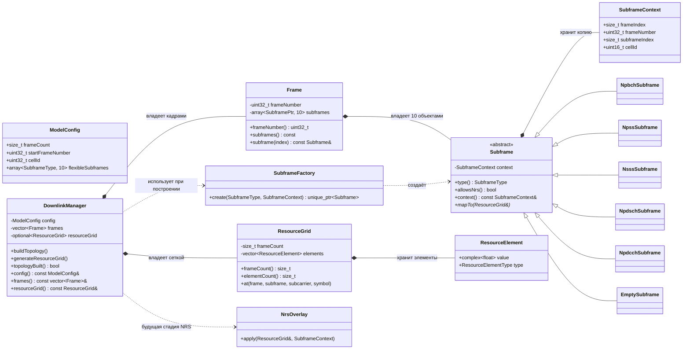
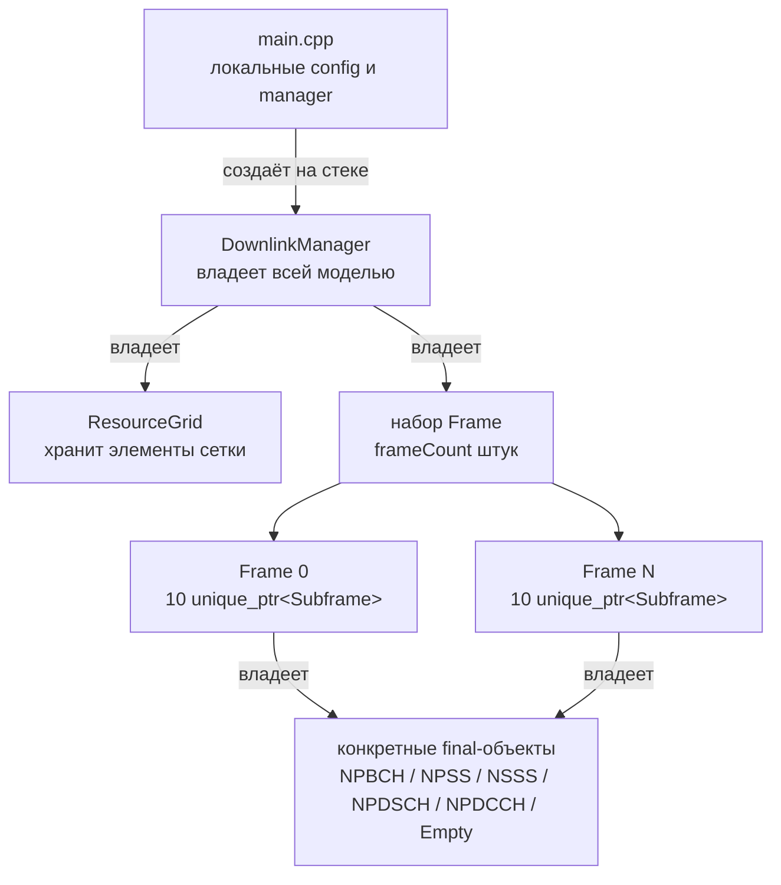
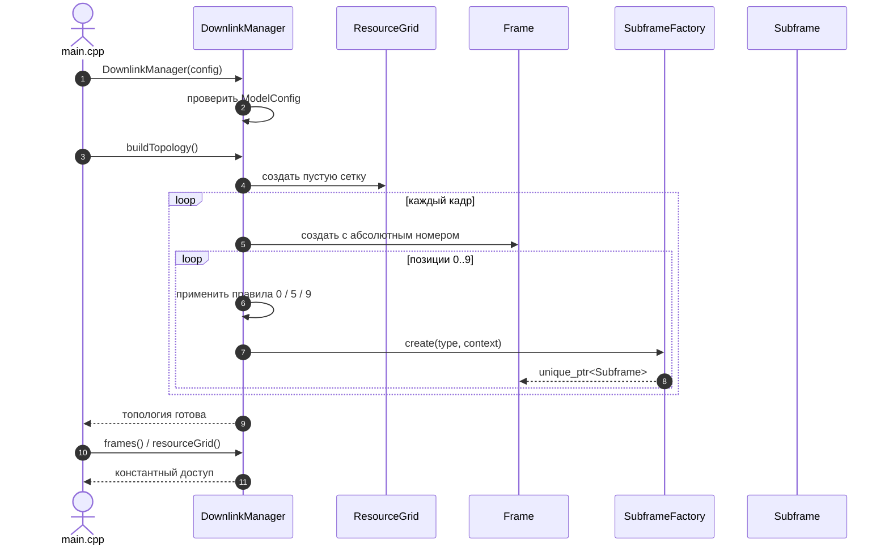
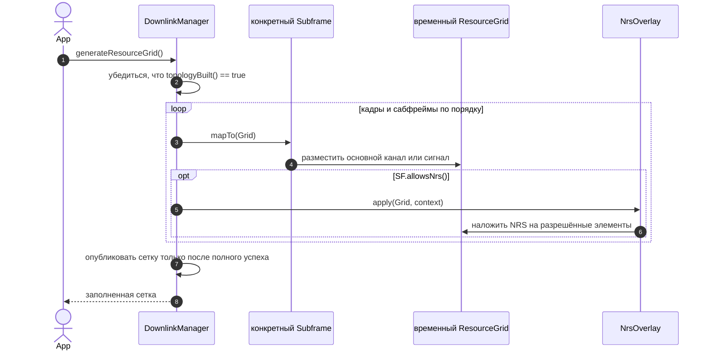

# Архитектура каркаса Downlink NB-IoT

## 1. Зачем нужен отдельный архитектурный слой

MATLAB-модель строится сверху вниз: корневой объект ресурсной сетки создаёт
кадры, каждый кадр создаёт десять сабфреймов, а сабфрейм выбирает и генерирует
свой сигнал или канал. В C++ сохранена эта понятная иерархия, но обязанности
разделены строже:

- `DownlinkManager` управляет общим сценарием;
- `Frame` отвечает за состав одного кадра;
- `Subframe` задаёт общий интерфейс любого сабфрейма;
- `SubframeFactory` знает, какой конкретный класс создать;
- `ResourceGrid` только хранит ресурсные элементы;
- `NrsOverlay` выделяет NRS в самостоятельную будущую стадию.

Вся новая архитектура находится в `namespace nbiot`.

> [!IMPORTANT]
> Это архитектурная заготовка, а не готовый генератор. Сейчас можно создать
> конфигурацию, кадры, сабфреймы и пустую сетку. Формулы физических каналов,
> сигналов и NRS в `mapTo()`/`apply()` намеренно отсутствуют.

Существующие в репозитории алгоритмы CRC, TBCC, Rate Matcher, Scrambler, QPSK,
NPSS и NSSS пока остаются отдельными модулями. Архитектурный слой не должен
делать вид, что интеграция уже выполнена.

## 2. Сопоставление MATLAB и C++

Перенос не является механическим переводом «один MATLAB-файл — один такой же
C++-файл». Таблица показывает соответствие **ответственности**:

| MATLAB-сущность | C++-сущность | Что изменилось |
|---|---|---|
| `Main.m` | `src/main.cpp` | Точка входа только задаёт конфигурацию, создаёт менеджер и печатает топологию. |
| `NBIoTResourceGrid` | `nbiot::DownlinkManager` + `nbiot::ResourceGrid` | Управление сценарием отделено от хранения данных. |
| `Config` внутри `NBIoTResourceGrid` | `nbiot::ModelConfig` | Конфигурация стала отдельным типизированным объектом. |
| `NBIoTFrame` | `nbiot::Frame` | Кадр владеет ровно десятью полиморфными сабфреймами. |
| один класс `NBIoTSubframe` и `switch` | абстрактный `nbiot::Subframe` + шесть `final`-классов | У каждого типа есть собственное место для реализации. |
| `getSubframeType.m` | правила в менеджере + `SubframeFactory::create()` | Выбор типа отделён от алгоритма самого сабфрейма. |
| `gridGen.m` | `Subframe::mapTo(ResourceGrid&)` | Общий виртуальный договор; реализации пока являются заглушками. |
| `gen_NRS.m` из сабфрейма | `nbiot::NrsOverlay::apply()` | NRS накладывается отдельной стадией после канала. |
| числовые слои MATLAB-массива | `ResourceElement` внутри `ResourceGrid` | Комплексное значение и тип сигнала хранятся вместе и имеют явные типы. |
| `parentGrid`/`parentFrame` | `SubframeContext` + одностороннее владение | Нет обратных владеющих ссылок и циклов времени жизни. |
| `NBIoTNPDSCHScheduler`, `NBIoTNPDCCHScheduler` | пока отсутствуют | Планировщики находятся за границей первой версии. |
| `NBIoTOFDM` | пока отсутствует в новом слое | Существующий экспериментальный код не подключён к менеджеру. |
| `showResourceGrid`, `showSignal`, `showSpectr` | пока отсутствуют | Визуализация не входит в каркас. |

Такое разделение полезно для обучения: контейнер данных, правила построения и
алгоритмы не смешиваются в одном классе.

## 3. Общая схема классов



Диаграмма показывает два разных вида отношений:

- сплошная связь с ромбом означает владение и совместное время жизни;
- пунктир означает использование без владения.

## 4. Владение объектами и время жизни



Правило простое:

1. `main.cpp` создаёт один менеджер.
2. Менеджер владеет кадрами и ресурсной сеткой.
3. Каждый кадр владеет своими десятью сабфреймами.
4. Сабфрейм не владеет кадром или менеджером в обратную сторону.
5. При уничтожении менеджера C++ автоматически уничтожает всю вложенную
   структуру.

Здесь не нужен `std::shared_ptr`: у каждого объекта есть один понятный
владелец. `std::unique_ptr<Subframe>` буквально означает «этот кадр —
единственный владелец данного сабфрейма».

### Почему сабфреймы хранятся через `unique_ptr`

Все конкретные сабфреймы имеют общий базовый класс, но являются разными
типами. Нельзя положить объекты разного размера непосредственно в один
`std::array<Subframe, 10>`. Кроме того, `Subframe` абстрактен, и экземпляр
самого базового класса создать нельзя.

Поэтому кадр хранит указатели на общий интерфейс:

```cpp
std::array<std::unique_ptr<Subframe>, 10>
```

Внутри одного указателя может находиться `NpbchSubframe`, внутри другого —
`NpssSubframe` и так далее. При вызове виртуального `mapTo()` C++ выбирает
реализацию реального объекта.

### Зачем виртуальный деструктор

Объект конкретного класса уничтожается через указатель `Subframe*`. Поэтому
деструктор базового класса должен быть виртуальным. Тогда сначала корректно
уничтожается конкретная часть объекта, а затем базовая. Это обязательное
правило для полиморфного базового класса, которым владеют через указатель.

## 5. Основные типы простыми словами

### `ModelConfig`

`ModelConfig` — все входные настройки, необходимые каркасу:

| Поле | Значение |
|---|---|
| `frameCount` | сколько кадров построить; ноль считается ошибкой |
| `startFrameNumber` | абсолютный номер первого кадра |
| `cellId` | идентификатор соты, допустимый диапазон 0–503 |
| `flexibleSubframes` | желаемый тип каждой из десяти позиций |

В `flexibleSubframes` разрешены только `Empty`, `Npdsch` и `Npdcch`.
Фиксированные NPBCH, NPSS и NSSS назначает менеджер. Это не позволяет
случайно выключить обязательный сабфрейм пользовательской настройкой.

### `SubframeType`

`SubframeType` — enum, то есть ограниченный набор допустимых значений:

```cpp
enum class SubframeType {
    Empty,
    Npbch,
    Npss,
    Nsss,
    Npdsch,
    Npdcch,
};
```

Enum безопаснее произвольной строки. Опечатка вроде `"NPDSHC"` не сможет
незаметно попасть в программу: компилятор принимает только перечисленные
значения.

### `SubframeContext`

Контекст содержит сведения, которые нужны конкретному сабфрейму:

- абсолютный номер кадра;
- индекс кадра внутри текущей модели;
- номер сабфрейма от 0 до 9;
- `cellId`.

Контекст заменяет обратные ссылки MATLAB `parentFrame` и `parentGrid`.
Сабфрейм получает необходимые значения, но не управляет временем жизни
родителей.

### Абстрактный `Subframe`

Абстрактный класс — это договор, а не готовый объект. Он говорит:

> Любой сабфрейм обязан уметь назвать свой тип, вернуть контекст, сообщить о
> допустимости NRS и иметь операцию размещения в сетку.

Операция:

```cpp
virtual void mapTo(ResourceGrid& grid) const = 0;
```

является чисто виртуальной из-за `= 0`. Поэтому каждый конкретный класс
обязан предоставить свою реализацию.

Сейчас реализации `mapTo()` содержат только понятную ошибку
`std::logic_error`. Это намеренное поведение: заглушка не должна выдавать
нулевую сетку за вычисленный результат.

### Конкретные сабфреймы

Для каждого типа предусмотрен отдельный `final`-класс:

| Класс | Роль |
|---|---|
| `NpbchSubframe` | будущий маппинг NPBCH |
| `NpssSubframe` | будущий маппинг NPSS |
| `NsssSubframe` | будущий маппинг NSSS |
| `NpdschSubframe` | будущий маппинг пользовательских/служебных данных NPDSCH |
| `NpdcchSubframe` | будущий маппинг управляющей информации NPDCCH |
| `EmptySubframe` | позиция без выделенного физического канала |

Слово `final` означает, что от этого конкретного класса не предполагается
дальнейшее наследование. Алгоритм следует добавлять прямо в его `.cpp`.

`EmptySubframe` означает «нет основного канала». В будущей модели в такой
позиции всё ещё может появиться NRS, если `allowsNrs()` это разрешает.

### `SubframeFactory`

Фабрика — единственное место, где enum преобразуется в конкретный C++-класс:

```text
SubframeType::Npbch  -> NpbchSubframe
SubframeType::Npss   -> NpssSubframe
SubframeType::Nsss   -> NsssSubframe
SubframeType::Npdsch -> NpdschSubframe
SubframeType::Npdcch -> NpdcchSubframe
SubframeType::Empty  -> EmptySubframe
```

Она возвращает `std::unique_ptr<Subframe>`. Вызывающему коду не нужно знать
размер конкретного класса или вручную писать `new`/`delete`.

### `Frame`

`Frame` хранит:

- абсолютный номер кадра;
- ровно десять `std::unique_ptr<Subframe>`;
- константный доступ к ним для чтения.

Кадр не решает, какие формулы использовать, и не владеет менеджером.

### `DownlinkManager`

Менеджер — координатор, а не место для всех формул. Он:

- проверяет `ModelConfig`;
- строит пустой `ResourceGrid` нужного размера;
- создаёт кадры и выбирает типы их сабфреймов;
- вызывает фабрику;
- хранит готовую топологию;
- в будущем последовательно запускает `mapTo()` и `NrsOverlay::apply()`.

Методы `frames()` и `resourceGrid()` возвращают константный доступ. Внешний
код может посмотреть результат, но не должен обходить менеджер и произвольно
ломать структуру.

## 6. Правила выбора сабфрейма

В модели используются нулевые индексы: номера сабфреймов — `0..9`.

| Позиция | Правило | Можно ли переопределить конфигурацией |
|---:|---|:---:|
| 0 | `Npbch` | нет |
| 5 | `Npss` | нет |
| 9 в чётном абсолютном кадре | `Nsss` | нет |
| 1–4 и 6–8 | `flexibleSubframes[position]` | да |
| 9 в нечётном абсолютном кадре | `flexibleSubframes[9]` | да |

Под «абсолютным номером» понимается:

```text
absoluteFrameNumber = startFrameNumber + frameIndex
```

Примеры:

| `startFrameNumber` | `frameIndex` | Абсолютный номер | Позиция 9 |
|---:|---:|---:|---|
| 0 | 0 | 0, чётный | `Nsss` |
| 0 | 1 | 1, нечётный | гибкая конфигурация |
| 7 | 0 | 7, нечётный | гибкая конфигурация |
| 7 | 1 | 8, чётный | `Nsss` |

Если в `flexibleSubframes[0]` записан `Npdsch`, менеджер всё равно создаст
`NpbchSubframe`. Аналогично фиксируется позиция 5 и позиция 9 чётного кадра.

## 7. Устройство `ResourceGrid`

### Размеры

Один сабфрейм содержит:

```text
12 поднесущих x 14 OFDM-символов
```

Четырнадцать символов получаются из двух слотов по семь символов. Для
`frameCount` кадров логические размеры всей сетки равны:

```text
frameCount x 10 сабфреймов x 12 поднесущих x 14 символов
```

### Ресурсный элемент

Одна ячейка `ResourceElement` хранит две независимые вещи:

- комплексное значение сигнала `std::complex<float>`;
- метку того, чем занята ячейка, включая отдельное значение для NRS.

Метка нужна не только для будущей визуализации. Она позволяет алгоритмам и
тестам отличать свободный ресурс от NPBCH, NPSS или NRS без угадывания по
числовому значению.

### Начальное состояние

`buildTopology()` создаёт сетку, но не генерирует сигнал:

- все комплексные значения равны нулю;
- все метки равны `Empty`;
- количество кадров и сабфреймов уже известно;
- доступ через `at(...)` проверяет каждую границу.

Выход за допустимый диапазон приводит к `std::out_of_range`. Ошибка возникает
рядом с неправильным обращением, а не превращается в повреждение памяти.

## 8. Жизненный цикл

У менеджера две отдельные стадии. Их нельзя считать взаимозаменяемыми.



Текущий `main.cpp` останавливается после этой последовательности и печатает
состав кадров.

Будущая алгоритмическая стадия выглядит так:



Пока первый вызов `mapTo()` выбрасывает `std::logic_error`, поэтому последняя
диаграмма описывает запланированный порядок, а не готовый численный расчёт.
Генерация выполняется во временной чистой сетке. Если любой сабфрейм или NRS
завершится ошибкой, менеджер не публикует частичный результат и оставляет
доступную через `resourceGrid()` сетку в прежнем согласованном состоянии.

### Допустимый порядок вызовов

```text
создать ModelConfig
        |
создать DownlinkManager
        |
buildTopology()
        |
читать frames() и resourceGrid()
        |
generateResourceGrid()  <-- только после реализации алгоритмов
```

Менеджер сообщает об ошибке, если:

- `frameCount == 0`;
- `cellId` выходит за диапазон 0–503;
- диапазон абсолютных номеров кадров переполняет `std::uint32_t`;
- в гибкой конфигурации встречается фиксированный тип;
- доступ к кадрам или сетке запрошен до `buildTopology()`;
- `buildTopology()` вызван повторно;
- `generateResourceGrid()` вызван до построения топологии;
- алгоритмическая заглушка ещё не заменена реализацией.

## 9. Почему NRS — отдельная стадия

В MATLAB NRS генерируется внутри объекта сабфрейма после основного канала. В
C++ сохранён порядок, но выделен отдельный объект `NrsOverlay`:

```text
сначала Subframe::mapTo(grid)
затем NrsOverlay::apply(grid, context)
```

Это даёт две выгоды:

1. Класс канала не смешивает свою формулу с общей формулой опорного сигнала.
2. Один алгоритм NRS можно использовать для нескольких типов сабфреймов.

`Subframe::allowsNrs()` описывает правило применимости. В этом каркасе NRS
разрешён для NPBCH, NPDSCH, NPDCCH и Empty, но запрещён для NPSS и NSSS.

Сейчас `NrsOverlay::apply()` также является честной заглушкой и выбрасывает
`std::logic_error`.

## 10. Как позже реализовать один сабфрейм

Лучше добавлять алгоритмы по одному. Например, для NPBCH:

1. Откройте реализацию `NpbchSubframe::mapTo()` в
   `src/model/subframes/`.
2. Выпишите входы алгоритма. Всё необходимое должно приходить через
   `SubframeContext`, конфигурацию либо отдельную явно переданную зависимость.
   Не добавляйте глобальные переменные.
3. Определите допустимые координаты внутри блока `12 x 14`.
4. Используйте `ResourceGrid::at(...)`, чтобы каждая запись проверяла границы.
5. Записывайте и комплексное значение, и правильную метку ресурса.
6. Не размещайте NRS внутри `mapTo()`: для него существует
   `NrsOverlay::apply()`.
7. Замените только заглушку выбранного класса. Остальные типы пусть продолжают
   явно сообщать, что их алгоритмы не реализованы.
8. Добавьте небольшие тесты: корректные координаты, значения, метки,
   отсутствие записи за пределами назначенной области и поведение на разных
   контекстах.
9. После реализации запустите полный CTest, чтобы новый алгоритм не сломал
   правила топологии и старые модули.

Псевдокод метода может выглядеть так:

```cpp
void NpbchSubframe::mapTo(ResourceGrid& grid) const {
    // 1. Получить или сформировать подготовленные символы NPBCH.
    // 2. Перебрать только разрешённые ресурсные элементы.
    // 3. Записать значение и метку NPBCH через grid.at(...).
    // 4. Не размещать здесь NRS.
}
```

Это только форма метода, а не реализация стандарта. Конкретные формулы и
таблицы должны сопровождаться отдельными тестовыми векторами и ссылкой на
использованную версию спецификации.

### Когда существующего контекста недостаточно

Не следует незаметно давать сабфрейму указатель на весь `DownlinkManager`.
Сначала определите точную зависимость:

- подготовленная последовательность символов;
- интерфейс кодера;
- результат планировщика;
- неизменяемая часть конфигурации.

Затем передайте именно эту зависимость через конструктор или отдельный
небольшой интерфейс. Так класс остаётся тестируемым и не получает доступ ко
всему состоянию программы.

## 11. Границы первой версии

В архитектурный каркас намеренно не входят:

- планировщик кодовых слов NPDSCH;
- планировщик DCI для NPDCCH;
- генерация SIB1-NB;
- полный конвейер CRC → кодирование → Rate Matching → Scrambling → QPSK;
- OFDM и циклический префикс;
- временной сигнал и спектр;
- графическая или консольная визуализация ресурсной сетки;
- параллельная генерация;
- интеграция старых алгоритмических классов с новыми сабфреймами.

Параллельность специально не закладывается заранее: будущие планировщики
могут иметь состояние, поэтому сначала нужен правильный последовательный
вариант.

## 12. Основное и демонстрационное приложения

В проекте два разных executable-target:

| Target | Исходная точка входа | Назначение |
|---|---|---|
| `NBIoT_CPP_Model` | `src/main.cpp` | основной пример новой архитектуры |
| `NBIoT_Pipeline_Demo` | `src/pipeline.cpp` | сохранённый старый алгоритмический demo |

Старый pipeline полезен как отдельный эксперимент и источник будущей
интеграции. Он не должен подключаться к `main.cpp` и не является частью
жизненного цикла `DownlinkManager`.

## 13. Проверка изменений

Типичный цикл разработчика:

```bash
cmake -S . -B build
cmake --build build
ctest --test-dir build --output-on-failure
```

Архитектурные тесты должны проверять не формулы сигнала, а договор каркаса:

- фабрика создаёт правильный конкретный класс;
- в кадре ровно десять сабфреймов;
- позиции 0, 5 и 9 назначаются по правилам;
- чётность берётся из абсолютного номера кадра;
- неверная конфигурация отклоняется;
- сетка имеет размеры `12 x 14` на сабфрейм и начинается пустой;
- выход за границу сетки отклоняется;
- неправильный порядок стадий отклоняется;
- незаполненные `mapTo()` и `NrsOverlay::apply()` не выдают ложный результат.

Если интернет недоступен и GoogleTest ещё не загружен, можно проверить хотя
бы сборку приложений:

```bash
cmake -S . -B build-no-tests -DENABLE_GTEST=OFF
cmake --build build-no-tests
```

Ранее сгенерированные `docs/html`, `docs/latex` и `docs/rtf` не являются
актуальным описанием нового слоя до отдельного осознанного запуска Doxygen.
